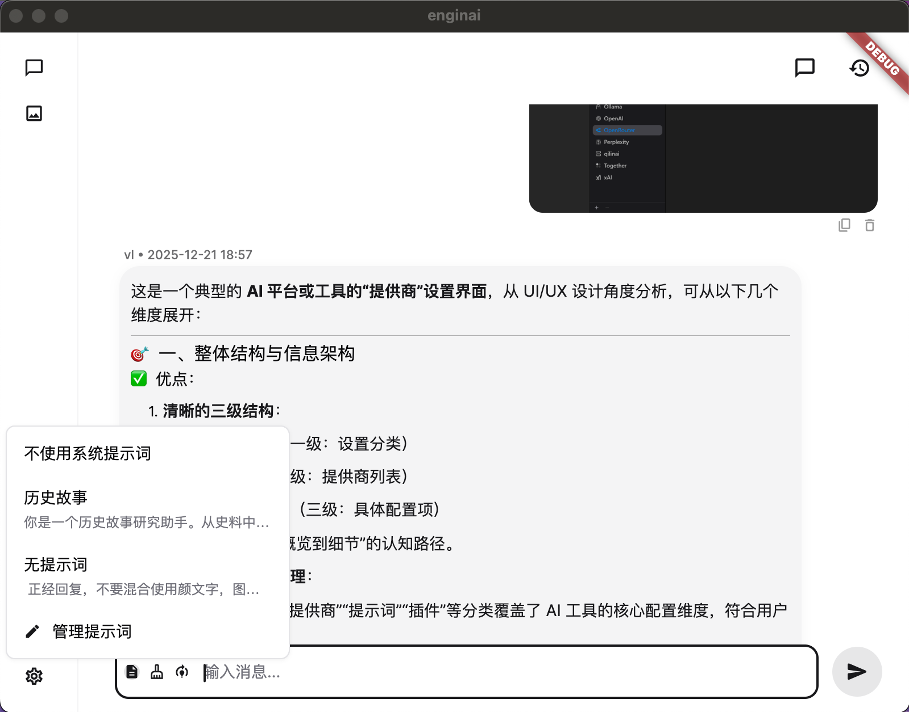
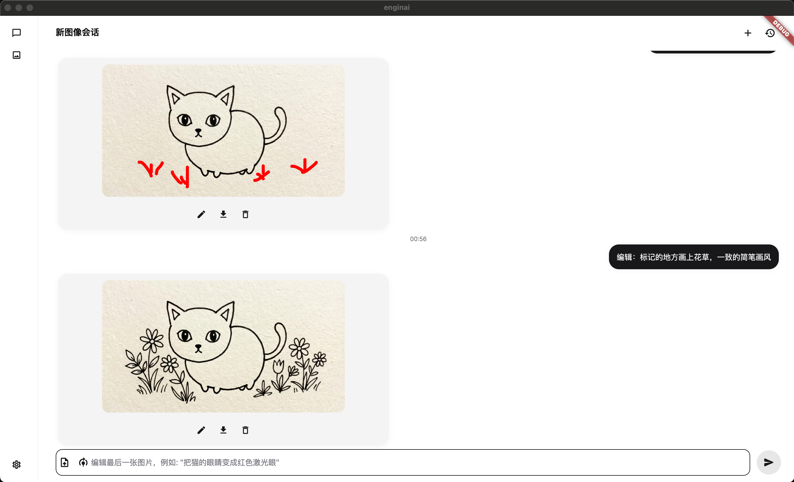

# Engineai

## LLM




## imagen models.




## Dependencies

 ```bash
flutter pub get
 ```
## Web Persistence

When running `flutter run -d chrome`, a temporary Chrome profile is created, meaning local data (Hive, SharedPreferences) is lost between restarts.

To persist data during development:

1. Run with a fixed port:
   ```bash
   flutter run -d chrome --web-port=8080
   ```
2. Open [http://localhost:8080](http://localhost:8080) in your *primary* Chrome browser (not the automated instance).

Data will now persist in your browser's local storage.

## macos
   ```bash
   flutter run -d macos
   ```


## windows
   ```bash
   flutter run -d windows
   flutter run -d windows --release
   ```
## 重构
   ```bash
   flutter clean
   ```
