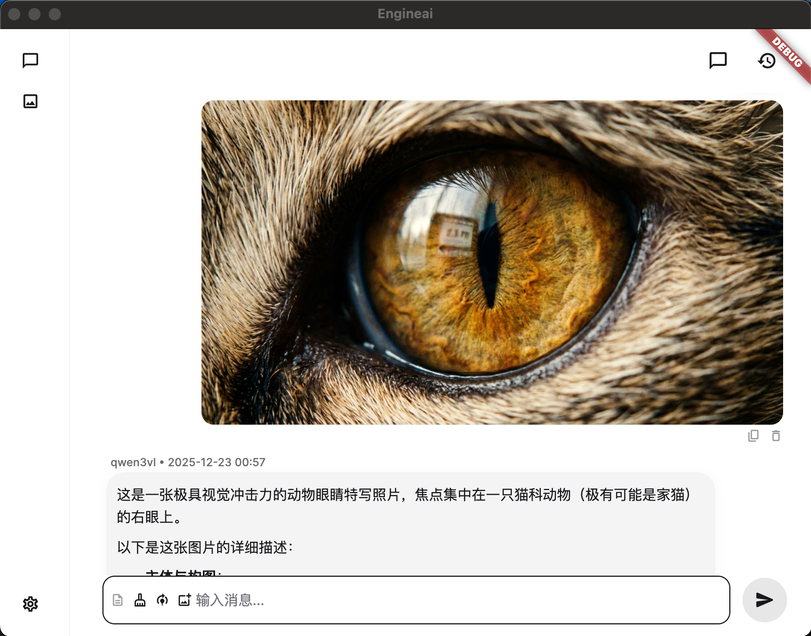
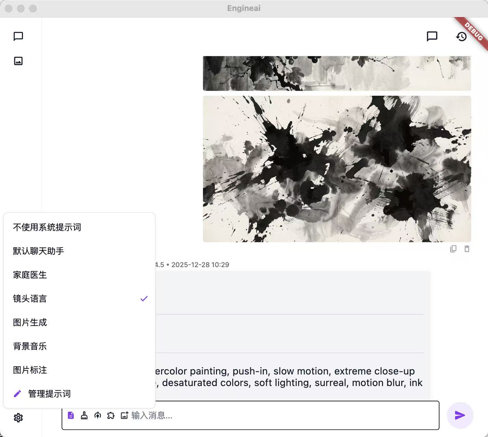
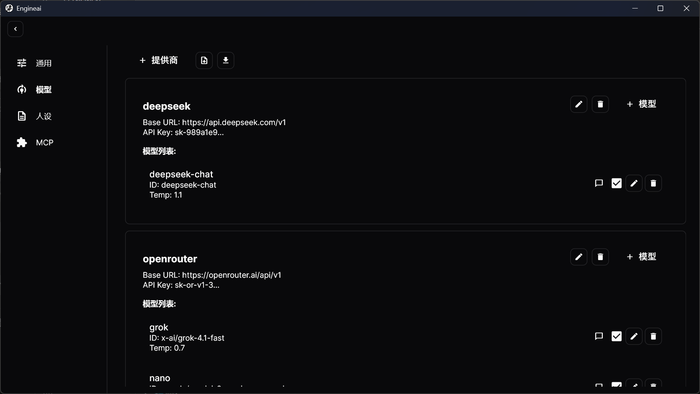

# Engineai_Release

一个LLM、VL和image生成的极简聊天软件，自己用来替代复杂无用的chat软件。

目前功能：

- openai api 兼容接口模型，对话聊天；
- vl 模型多图识别；
- image生成模型，图片识别，包括多图参考，历史最后一张图标记；
- 简单图片标注、编辑，作为参考。
- MPC 接口，可对接 streamable-http 协议。
- 多种黑色和亮色主题。
- MAC OS 版本只有 M2 环境，仅支持 ARM 架构，早期 Intel 不支持。


## LLM-VL




## 图像生成 models.


- openrouter和dmxapi接口；
- openaiapi兼容；





## 设置页



---

## 提示词管理

 ```bash
flutter pub get
 ```
## Web Persistence

When running `flutter run -d chrome`, a temporary Chrome profile is created, meaning local data (Hive, SharedPreferences) is lost between restarts.

To persist data during development:

1. Run with a fixed port:
   ```bash
   flutter run -d chrome --web-port=8080
   ```
2. Open [http://localhost:8080](http://localhost:8080) in your *primary* Chrome browser (not the automated instance).

Data will now persist in your browser's local storage.

## macos
   ```bash
   flutter run -d macos
   flutter run -d macos --release
   ```
---
提交：
git push https://github.com/code-2-art/Engineai.git main

---

 - 个人使用，除了替代大软件，还有是为了简单做图像的一些应用更方便；
 - 知识库可以连接mcp，没有必要写个连接，现在很多无代码给mcp接口的框架，很方便；
 - 有什么bug请提交到问题中，会尽快解决；

