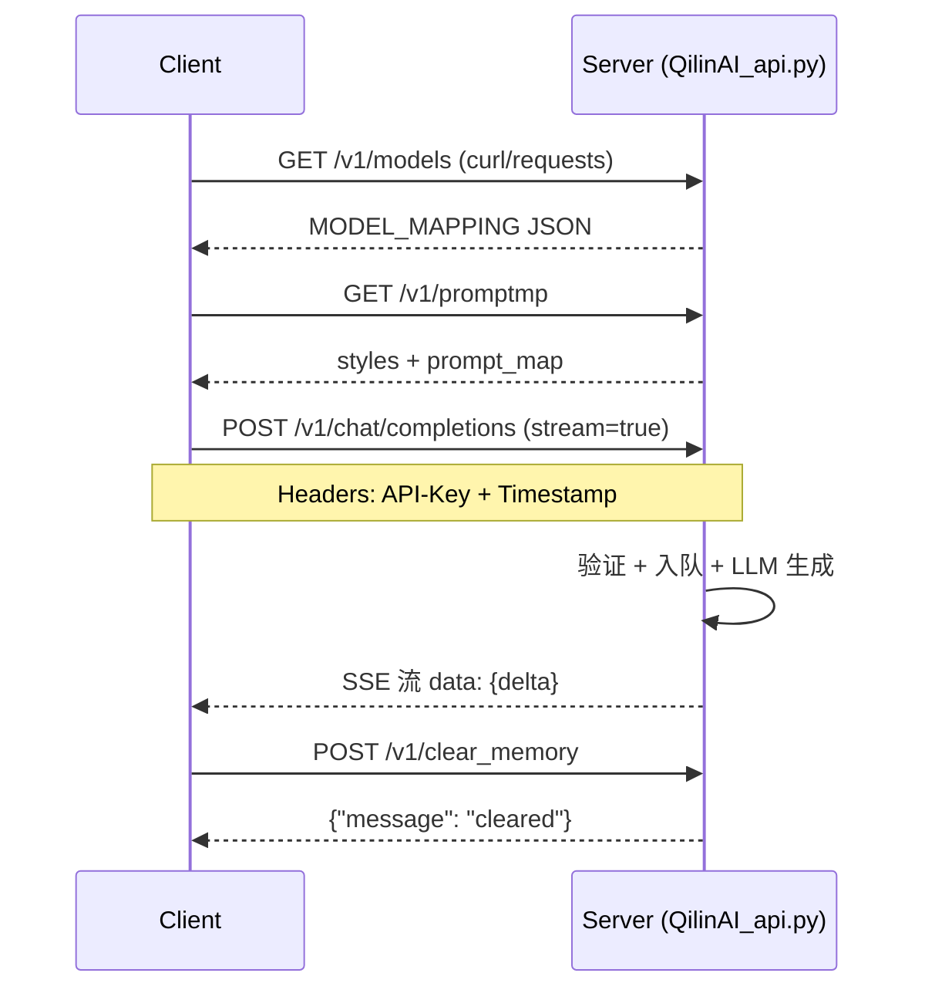

### QilinAI API 聊天写作接口总结

`QilinAI_api.py`[`QilinAI_api.py`](QilinAI_api.py) 是 FastAPI 构建的后端服务，主要提供聊天生成、模型管理、提示词配置和内存清空等接口，支持 OpenAI 兼容的聊天完成（chat completions），集成 LangChain 处理消息历史、系统提示和流式响应。服务使用信号量和队列限制并发（最大 5 个请求），支持重试机制、取消生成和 token 计数优化。所有聊天相关接口依赖 API 密钥验证（`verify_api_key`[`common/security.py`](common/security.py)）。

`test/post.py`[`test/post.py`](test/post.py) 是测试脚本，使用 `requests` 调用这些接口，包含 `test_chat_completions()`、`test_get_models()` 等示例，展示非流式/流式请求处理。

以下是指定接口的详细总结，包括端点、方法、参数、功能和示例。接口支持流式（SSE 格式：`data: {json}`）和非流式响应，历史记录存储在 `chat_histories` 字典中，按模型管理。

#### 1. **Chat 接口** (`/v1/chat/completions`)
   - **方法**: POST
   - **依赖**: `Depends(verify_api_key)`
   - **请求模型**: `ChatCompletionRequest`[`QilinAI_api.py:433`](QilinAI_api.py:433)
     | 参数 | 类型 | 默认值 | 描述 |
     |------|------|--------|------|
     | `model` | str | - | 模型名（如 "Deepseek-V3"），从 `MODEL_MAPPING`[`llm/model_mapping.py`](llm/model_mapping.py) 获取 |
     | `messages` | List[dict] | - | 消息列表，格式 `[{"role": "user/system/assistant", "content": "..."}]` |
     | `stream` | bool | False | 是否流式响应 |
     | `selected_feature` | Optional[str] | None | 功能模块（如占星），从 `PROMPT_MAP`[`fuwrite/write_map_config.py`](fuwrite/write_map_config.py) 加载提示 |
     | `selected_stage` | Optional[str] | None | 功能阶段 |
     | `selected_prompts` | List[str] | [] | 额外自定义提示 |
     | `writing_style` | str | "日常" | 写作风格，从 `WRITING_STYLES` 验证（如 "思考"、"日常"） |
     | `temperature` | float | 0.7 | 生成温度 |
   - **功能**:
     - 构建系统提示：合并写作风格（`WRITING_STYLE_PROMPTS`）、功能提示（`PROMPT_DETAILS`）和自定义提示。
     - 加载历史：`get_session_history(session_id)`[`llm/generation_service.py`](llm/generation_service.py)，限制 20 条，过滤重复。
     - 生成：使用 `MODEL_CONFIGS`[`llm/model_config.py`](llm/model_config.py) 初始化 LLM，支持 `astream`/`ainvoke`，流式 yield SSE 数据。
     - 优化：token 计数（`tiktoken`）、重试（网络/超时）、取消（`/v1/cancel_generation/{session_id}`）。
     - 负载检查：队列 > 15 时 429 错误。
   - **响应**:
     - 流式：`data: {"choices": [{"delta": {"content": "..."}}]}` 或 `{"error": "..."}`
     - 非流式：JSON 对象。
   - **测试示例** (`test/post.py:57-75`): 非流式调用 "Deepseek-V3"，打印响应。
   ```python
   payload = {"model": "Deepseek-V3", "messages": [{"role": "user", "content": "你好"}], "stream": False}
   ```


#### 2. **模型列表接口** (`/v1/models`)
   - **方法**: GET
   - **功能**: 返回 `MODEL_MAPPING`[`llm/model_mapping.py`](llm/model_mapping.py)，模型配置字典（如 {"Deepseek-V3": {...}}）。
   - **响应**: JSON 对象，列出可用模型。
   - **测试示例** (`test/post.py:226-235`): GET 请求，打印响应。

#### 3. **Promptmp 接口** (`/v1/promptmp`)
   - **方法**: GET
   - **功能**: 返回写作配置。
     - `writing_styles`: `WRITING_STYLES` 字典（键如 "日常"、"思考"）。
     - `prompt_map`: `PROMPT_MAP`[`fuwrite/write_map_config.py`](fuwrite/write_map_config.py)，功能-阶段映射。
   - **响应**: `{"writing_styles": {...}, "prompt_map": {...}}`
   - **用途**: 前端获取风格和提示模板，用于 chat 参数填充。
   - **测试**: `test/post.py` 无直接测试，可类似 models 接口调用。

#### 4. **Clear Memory 接口** (`/v1/clear_memory`)
   - **方法**: POST
   - **请求模型**: `ClearMemoryRequest`[`QilinAI_api.py:450`](QilinAI_api.py:450)
     | 参数 | 类型 | 描述 |
     |------|------|------|
     | `model` | str | 模型名 |
   - **功能**: 清空 `chat_histories[model]` 列表，重置会话历史。
   - **响应**: `{"message": "History cleared/not found for model: xxx"}`
   - **测试**: `test/post.py` 无示例，可 POST `{"model": "Deepseek-V3"}`。

#### 接口流程图（Mermaid）
```mermaid
graph TD
    A[客户端请求 /v1/chat/completions] --> B{API Key 验证?}
    B -->|否| C[401/403 错误]
    B -->|是| D[负载检查 & 入队]
    D --> E[构建系统提示<br/>+ 历史加载 & 过滤]
    E --> F[LLM 生成<br/>astream + 重试]
    F --> G{流式?}
    G -->|是| H[SSE: data: {delta/content}]
    G -->|否| I[JSON 响应]
    J[客户端 /v1/models] --> K[返回 MODEL_MAPPING]
    L[客户端 /v1/promptmp] --> M[返回 styles + prompt_map]
    N[客户端 /v1/clear_memory] --> O[清空 chat_histories[model]]
```

#### 其他相关特性
- **历史管理**: `chat_histories = {}`，`get_session_history(session_id)` 按 session_id（model + messages id）存储。
- **取消**: POST `/v1/cancel_generation/{session_id}` 设置 `cancel_tokens[session_id]`。
- **测试脚本** (`test/post.py`): 支持流式解析（`process_streaming_response`），头包含 `X-API-Key`、`X-API-Timestamp`。当前 main 只测试黄历，但易扩展。
- **依赖**: `fuwrite/write_map_config.py` (提示)、`llm/*` (模型/生成)、占星等模块集成到 chat（通过 `selected_feature`）。

这些接口实现高效的聊天写作服务，支持自定义提示和历史持久化。测试时确保服务器运行（`uvicorn QilinAI_api:app --port 8080`），API_KEY 有效。

<attempt_completion>
<parameter name="result">聊天写作接口总结已完成，包括 chat (/v1/chat/completions)、模型列表 (/v1/models)、promptmp (/v1/promptmp)、clear_memory (/v1/clear_memory) 的端点、参数、功能和流程图。</parameter>
</attempt_completion>


### QilinAI API 聊天写作接口总结（补充 POST/GET 示例）

基于 [`QilinAI_api.py`](QilinAI_api.py) 和 [`test/post.py`](test/post.py)，以下是接口总结，已补充**完整 POST/GET 调用示例**（使用 `curl` 和 Python `requests`，兼容 OpenAI 格式）。所有 POST 接口需 API 密钥验证（`X-API-Key` 和 `X-API-Timestamp`，由 `common/security.py`[`common/security.py`](common/security.py) 处理）。服务器地址假设 `http://localhost:8080`。

#### 1. **Chat 接口** (`/v1/chat/completions`)
   - **方法**: POST
   - **功能**: 聊天生成，支持流式、历史、提示自定义（详见前总结）。
   - **curl 示例**（流式）:
     ```bash
     curl -X POST "http://localhost:8080/v1/chat/completions" \
       -H "X-API-Key: 12395da9dfda7453d6dc6f885f23fb23" \
       -H "X-API-Timestamp: $(date +%s)" \
       -H "Content-Type: application/json" \
       -d '{
         "model": "Deepseek-V3",
         "messages": [{"role": "user", "content": "你好，介绍一下你自己"}],
         "stream": true,
         "writing_style": "日常",
         "temperature": 0.7
       }'
     ```
     - 响应: SSE 流 `data: {"choices": [{"delta": {"content": "..."}}]}\n\n`
   - **Python 示例**（`test/post.py:57-75` 类似，非流式）:
     ```python
     import requests, time, json
     BASE_URL = "http://localhost:8080"
     API_KEY = "12395da9dfda7453d6dc6f885f23fb23"

     def get_headers():
         return {"X-API-Key": API_KEY, "X-API-Timestamp": str(int(time.time())), "Content-Type": "application/json"}

     payload = {
         "model": "Deepseek-V3",
         "messages": [{"role": "user", "content": "你好"}],
         "stream": False
     }
     response = requests.post(f"{BASE_URL}/v1/chat/completions", headers=get_headers(), json=payload)
     print(response.json())
     ```

#### 2. **模型列表接口** (`/v1/models`)
   - **方法**: GET
   - **功能**: 返回可用模型列表。
   - **curl 示例**:
     ```bash
     curl -X GET "http://localhost:8080/v1/models" \
       -H "X-API-Key: 12395da9dfda7453d6dc6f885f23fb23" \
       -H "X-API-Timestamp: $(date +%s)"
     ```
     - 响应: `{"Deepseek-V3": {...}, ...}`
   - **Python 示例**（`test/post.py:226-235`）:
     ```python
     response = requests.get(f"{BASE_URL}/v1/models", headers=get_headers())
     print(response.json())
     ```

#### 3. **Promptmp 接口** (`/v1/promptmp`)
   - **方法**: GET
   - **功能**: 返回写作风格和提示映射。
   - **curl 示例**:
     ```bash
     curl -X GET "http://localhost:8080/v1/promptmp" \
       -H "X-API-Key: 12395da9dfda7453d6dc6f885f23fb23" \
       -H "X-API-Timestamp: $(date +%s)"
     ```
     - 响应: `{"writing_styles": {"日常": ...}, "prompt_map": {...}}`
   - **Python 示例**:
     ```python
     response = requests.get(f"{BASE_URL}/v1/promptmp", headers=get_headers())
     print(response.json())
     ```

#### 4. **Clear Memory 接口** (`/v1/clear_memory`)
   - **方法**: POST
   - **功能**: 清空指定模型历史。
   - **curl 示例**:
     ```bash
     curl -X POST "http://localhost:8080/v1/clear_memory" \
       -H "X-API-Key: 12395da9dfda7453d6dc6f885f23fb23" \
       -H "X-API-Timestamp: $(date +%s)" \
       -H "Content-Type: application/json" \
       -d '{"model": "Deepseek-V3"}'
     ```
     - 响应: `{"message": "History cleared for model: Deepseek-V3"}`
   - **Python 示例**:
     ```python
     payload = {"model": "Deepseek-V3"}
     response = requests.post(f"{BASE_URL}/v1/clear_memory", headers=get_headers(), json=payload)
     print(response.json())
     ```

#### 通用处理流式响应（Python，从 `test/post.py:25-50` 提取）
```python
def process_streaming_response(response):
    full_content = ""
    for line in response.iter_lines():
        if line and line.decode('utf-8').startswith('data: '):
            data = json.loads(line.decode('utf-8')[6:])
            if 'choices' in data:
                content = data['choices'][0]['delta'].get('content', '')
                full_content += content
                print(content, end='', flush=True)
            elif 'error' in data:
                print(f"\n错误: {data['error']}")
    print()  # 换行
```

#### 接口调用流程图（Mermaid，补充示例）

