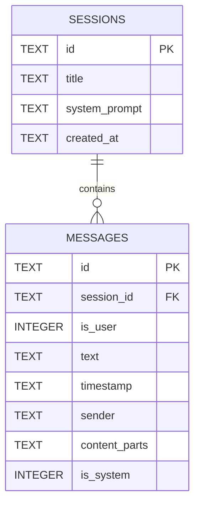

# Chat History 服务 SQLite 优化计划

## 问题分析
当前 [`lib/services/chat_history_service.dart`](lib/services/chat_history_service.dart) 中的 `getSessions()` 方法：
- 从 Hive box 获取 `'sessions'` key 的完整 JSON 列表（每个 ChatSession 包含所有 messages）。
- 逐一 `json.decode` 并创建完整 [`ChatSession`](lib/models/chat_session.dart) 对象。
- 排序后取最近 2 个。
  
即使只取 2 个，如果历史会话多、每会话消息长，解析全量 JSON 耗时严重，导致启动慢。

此外，`getSummaries()` 加载所有 `SessionSummary`，但轻量。

## 优化方案：迁移到 SQLite
使用关系型数据库分离存储：
- **sessions 表**：存储会话元数据（id, title, system_prompt, created_at）。
- **messages 表**：存储消息详情（id, session_id, is_user, text 等）。

### 数据库 Schema (Mermaid ER 图)

### 关键改进
- `getSessions()`：查询 `sessions` 表 `ORDER BY created_at DESC LIMIT 2`，然后为每个加载 `messages`，构建完整 `ChatSession`（仅 2 个会话，高效）。
- `saveSession()`：UPSERT sessions 元数据，DELETE 旧 messages，INSERT 新 messages。
- `getSummaries()`：直接 `SELECT id, title, created_at FROM sessions`（无需额外表）。
- **自动迁移**：首次使用时，从 Hive box 遍历所有 keys（session id），加载 JSON，解析 `ChatSession`，插入 DB。然后清空 Hive。

### 依赖
- 添加 `sqflite: ^2.3.3` 到 [`pubspec.yaml`](pubspec.yaml)。
- 已存在 `path_provider` 用于 DB 路径。

### 风险与注意
- 桌面平台（Windows/macOS）需 `sqflite_ffi` 支持（可选，先移动端）。
- 模型不变：`ChatSession` 仍需完整 messages，但仅限最近 2 个。
- Hive 仍用于 image_history，可后续优化。
- 测试：创建 10+ 长会话，比较启动时间。

## Todo 列表
见当前 todo（已更新）。

此计划聚焦最小变更、高效启动。