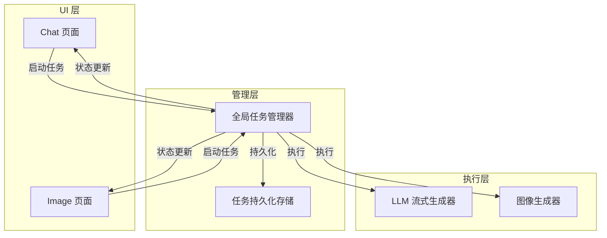
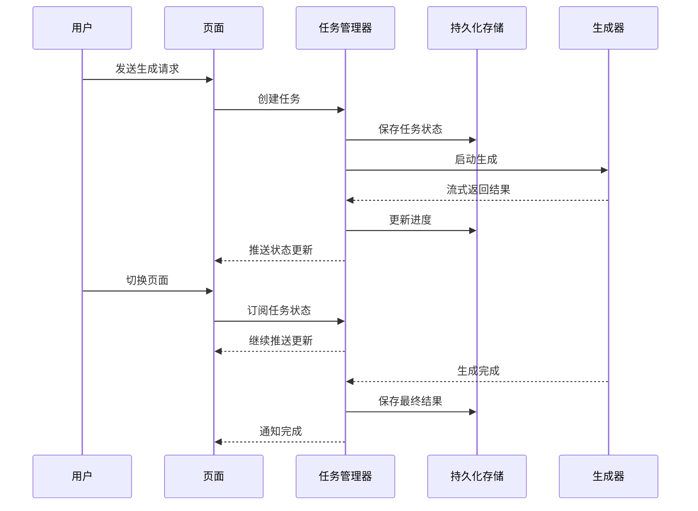

# 生成任务持久化方案

## 问题分析

### 当前问题
当用户在 chat 或 image 页面生成内容时切换页面，生成任务会被中断：

1. **Chat 页面问题**：
   - 使用 `StreamSubscription` 监听流式响应
   - `dispose()` 方法调用 `_responseSubscription?.cancel()` 直接中断生成
   - `currentResponseProvider` 是页面级状态，切换后无法恢复

2. **Image 页面问题**：
   - 虽然使用了后台生成，但任务仍与页面生命周期绑定
   - 页面销毁可能导致后台任务被取消
   - 生成进度没有持久化，切换后无法恢复

### 根本原因
- 生成任务与页面生命周期强绑定
- 缺乏全局任务管理器
- 没有任务状态持久化机制

---

## 解决方案架构

### 系统架构图



### 工作流程



---

## 实现步骤

### 步骤 1: 创建任务模型

**文件**: `lib/models/generation_task.dart`

```dart
import 'dart:typed_data';

enum TaskType { chat, image }
enum TaskStatus { pending, running, paused, completed, failed, cancelled }

class GenerationTask {
  final String id;
  final TaskType type;
  final TaskStatus status;
  final DateTime createdAt;
  final DateTime? completedAt;
  final String sessionId;
  final Map<String, dynamic> params;
  String? currentResponse;
  Uint8List? generatedImage;
  String? error;

  GenerationTask({
    required this.id,
    required this.type,
    required this.status,
    required this.createdAt,
    this.completedAt,
    required this.sessionId,
    required this.params,
    this.currentResponse,
    this.generatedImage,
    this.error,
  });

  GenerationTask copyWith({
    TaskType? type,
    TaskStatus? status,
    DateTime? completedAt,
    String? currentResponse,
    Uint8List? generatedImage,
    String? error,
  }) {
    return GenerationTask(
      id: id,
      type: type ?? this.type,
      status: status ?? this.status,
      createdAt: createdAt,
      completedAt: completedAt ?? this.completedAt,
      sessionId: sessionId,
      params: params,
      currentResponse: currentResponse ?? this.currentResponse,
      generatedImage: generatedImage ?? this.generatedImage,
      error: error ?? this.error,
    );
  }

  Map<String, dynamic> toJson() {
    return {
      'id': id,
      'type': type.name,
      'status': status.name,
      'createdAt': createdAt.toIso8601String(),
      'completedAt': completedAt?.toIso8601String(),
      'sessionId': sessionId,
      'params': params,
      'currentResponse': currentResponse,
      'error': error,
      // generatedImage 需要特殊处理，因为 Uint8List 不能直接序列化
    };
  }

  factory GenerationTask.fromJson(Map<String, dynamic> json) {
    return GenerationTask(
      id: json['id'] as String,
      type: TaskType.values.firstWhere((e) => e.name == json['type']),
      status: TaskStatus.values.firstWhere((e) => e.name == json['status']),
      createdAt: DateTime.parse(json['createdAt'] as String),
      completedAt: json['completedAt'] != null 
          ? DateTime.parse(json['completedAt'] as String) 
          : null,
      sessionId: json['sessionId'] as String,
      params: json['params'] as Map<String, dynamic>,
      currentResponse: json['currentResponse'] as String?,
      error: json['error'] as String?,
    );
  }
}
```

### 步骤 2: 创建任务持久化服务

**文件**: `lib/services/task_storage_service.dart`

```dart
import 'dart:convert';
import 'package:shared_preferences/shared_preferences.dart';
import 'package:uuid/uuid.dart';
import '../models/generation_task.dart';

class TaskStorageService {
  static const String _tasksKey = 'generation_tasks';
  final SharedPreferences _prefs;
  final Uuid _uuid = const Uuid();

  TaskStorageService(this._prefs);

  // 保存任务列表
  Future<void> saveTasks(List<GenerationTask> tasks) async {
    final tasksJson = tasks.map((task) => task.toJson()).toList();
    await _prefs.setString(_tasksKey, json.encode(tasksJson));
  }

  // 加载任务列表
  Future<List<GenerationTask>> loadTasks() async {
    final tasksStr = _prefs.getString(_tasksKey);
    if (tasksStr == null) return [];
    
    try {
      final tasksJson = json.decode(tasksStr) as List;
      return tasksJson
          .map((json) => GenerationTask.fromJson(json as Map<String, dynamic>))
          .toList();
    } catch (e) {
      print('加载任务失败: $e');
      return [];
    }
  }

  // 添加任务
  Future<void> addTask(GenerationTask task) async {
    final tasks = await loadTasks();
    tasks.add(task);
    await saveTasks(tasks);
  }

  // 更新任务
  Future<void> updateTask(GenerationTask updatedTask) async {
    final tasks = await loadTasks();
    final index = tasks.indexWhere((t) => t.id == updatedTask.id);
    if (index != -1) {
      tasks[index] = updatedTask;
      await saveTasks(tasks);
    }
  }

  // 删除任务
  Future<void> deleteTask(String taskId) async {
    final tasks = await loadTasks();
    tasks.removeWhere((t) => t.id == taskId);
    await saveTasks(tasks);
  }

  // 获取指定类型的任务
  Future<List<GenerationTask>> getTasksByType(TaskType type) async {
    final tasks = await loadTasks();
    return tasks.where((t) => t.type == type).toList();
  }

  // 获取运行中的任务
  Future<List<GenerationTask>> getRunningTasks() async {
    final tasks = await loadTasks();
    return tasks.where((t) => t.status == TaskStatus.running).toList();
  }

  // 清理已完成的任务（保留最近 N 个）
  Future<void> cleanupCompletedTasks({int keepCount = 10}) async {
    final tasks = await loadTasks();
    final completedTasks = tasks
        .where((t) => t.status == TaskStatus.completed)
        .toList()
      ..sort((a, b) => b.completedAt!.compareTo(a.completedAt!));
    
    if (completedTasks.length > keepCount) {
      final toRemove = completedTasks.skip(keepCount);
      for (final task in toRemove) {
        tasks.remove(task);
      }
      await saveTasks(tasks);
    }
  }
}
```

### 步骤 3: 创建全局任务管理器

**文件**: `lib/services/generation_task_manager.dart`

```dart
import 'dart:async';
import 'dart:typed_data';
import 'package:flutter_riverpod/flutter_riverpod.dart';
import 'package:uuid/uuid.dart';
import '../models/generation_task.dart';
import 'task_storage_service.dart';
import 'llm_provider.dart';
import 'image_provider.dart';
import 'session_provider.dart';
import 'image_session_provider.dart';

class GenerationTaskManager {
  final TaskStorageService _storage;
  final Uuid _uuid = const Uuid();
  
  // 任务状态缓存
  final Map<String, GenerationTask> _tasks = {};
  final Map<String, StreamController<GenerationTask>> _controllers = {};
  final Map<String, StreamSubscription> _subscriptions = {};

  GenerationTaskManager(this._storage);

  // 初始化：加载已保存的任务
  Future<void> init() async {
    final savedTasks = await _storage.loadTasks();
    for (final task in savedTasks) {
      _tasks[task.id] = task;
      
      // 如果有运行中的任务，恢复它们
      if (task.status == TaskStatus.running) {
        _resumeTask(task);
      }
    }
  }

  // 获取任务
  GenerationTask? getTask(String taskId) {
    return _tasks[taskId];
  }

  // 获取指定类型的所有任务
  List<GenerationTask> getTasksByType(TaskType type) {
    return _tasks.values.where((t) => t.type == type).toList();
  }

  // 获取指定类型的运行中任务
  GenerationTask? getRunningTask(TaskType type) {
    return _tasks.values
        .where((t) => t.type == type && t.status == TaskStatus.running)
        .firstOrNull;
  }

  // 监听任务状态
  Stream<GenerationTask> watchTask(String taskId) {
    if (!_controllers.containsKey(taskId)) {
      _controllers[taskId] = StreamController<GenerationTask>.broadcast();
    }
    return _controllers[taskId]!.stream;
  }

  // 创建 Chat 任务
  Future<String> createChatTask(
    String sessionId,
    String prompt,
    List<Map<String, dynamic>>? userContentParts,
    String? systemPrompt,
    WidgetRef ref,
  ) async {
    final taskId = _uuid.v4();
    final task = GenerationTask(
      id: taskId,
      type: TaskType.chat,
      status: TaskStatus.pending,
      createdAt: DateTime.now(),
      sessionId: sessionId,
      params: {
        'prompt': prompt,
        'userContentParts': userContentParts,
        'systemPrompt': systemPrompt,
      },
    );
    
    await _addTask(task);
    await _startChatTask(task, ref);
    return taskId;
  }

  // 创建 Image 任务
  Future<String> createImageTask(
    String sessionId,
    String prompt,
    List<String>? base64Images,
    WidgetRef ref,
  ) async {
    final taskId = _uuid.v4();
    final task = GenerationTask(
      id: taskId,
      type: TaskType.image,
      status: TaskStatus.pending,
      createdAt: DateTime.now(),
      sessionId: sessionId,
      params: {
        'prompt': prompt,
        'base64Images': base64Images,
      },
    );
    
    await _addTask(task);
    await _startImageTask(task, ref);
    return taskId;
  }

  // 暂停任务
  Future<void> pauseTask(String taskId) async {
    final task = _tasks[taskId];
    if (task == null || task.status != TaskStatus.running) return;

    final updatedTask = task.copyWith(status: TaskStatus.paused);
    await _updateTask(updatedTask);
    
    // 取消订阅
    _subscriptions[taskId]?.cancel();
    _subscriptions.remove(taskId);
  }

  // 恢复任务
  Future<void> resumeTask(String taskId) async {
    final task = _tasks[taskId];
    if (task == null || task.status != TaskStatus.paused) return;

    await _resumeTask(task);
  }

  // 取消任务
  Future<void> cancelTask(String taskId) async {
    final task = _tasks[taskId];
    if (task == null) return;

    final updatedTask = task.copyWith(
      status: TaskStatus.cancelled,
      completedAt: DateTime.now(),
    );
    await _updateTask(updatedTask);
    
    // 取消订阅
    _subscriptions[taskId]?.cancel();
    _subscriptions.remove(taskId);
  }

  // 内部方法：添加任务
  Future<void> _addTask(GenerationTask task) async {
    _tasks[task.id] = task;
    await _storage.addTask(task);
    _notifyTaskUpdate(task);
  }

  // 内部方法：更新任务
  Future<void> _updateTask(GenerationTask task) async {
    _tasks[task.id] = task;
    await _storage.updateTask(task);
    _notifyTaskUpdate(task);
  }

  // 内部方法：通知任务更新
  void _notifyTaskUpdate(GenerationTask task) {
    _controllers[task.id]?.add(task);
  }

  // 内部方法：启动 Chat 任务
  Future<void> _startChatTask(GenerationTask task, WidgetRef ref) async {
    final updatedTask = task.copyWith(status: TaskStatus.running);
    await _updateTask(updatedTask);

    try {
      final llm = await ref.read(chatLlmProvider.future);
      final prompt = task.params['prompt'] as String;
      final userContentParts = task.params['userContentParts'] as List<Map<String, dynamic>>?;
      final systemPrompt = task.params['systemPrompt'] as String?;

      final stream = llm.generateStream(
        [],
        prompt,
        userContentParts: userContentParts,
        systemPrompt: systemPrompt ?? '',
      );

      final subscription = stream.listen(
        (delta) {
          final currentTask = _tasks[task.id];
          if (currentTask == null) return;
          
          final newResponse = (currentTask.currentResponse ?? '') + delta;
          final updatedTask = currentTask.copyWith(currentResponse: newResponse);
          _updateTask(updatedTask);
        },
        onDone: () async {
          final currentTask = _tasks[task.id];
          if (currentTask == null) return;
          
          final updatedTask = currentTask.copyWith(
            status: TaskStatus.completed,
            completedAt: DateTime.now(),
          );
          await _updateTask(updatedTask);
          _subscriptions.remove(task.id);
        },
        onError: (e) async {
          final currentTask = _tasks[task.id];
          if (currentTask == null) return;
          
          final updatedTask = currentTask.copyWith(
            status: TaskStatus.failed,
            completedAt: DateTime.now(),
            error: e.toString(),
          );
          await _updateTask(updatedTask);
          _subscriptions.remove(task.id);
        },
      );

      _subscriptions[task.id] = subscription;
    } catch (e) {
      final updatedTask = task.copyWith(
        status: TaskStatus.failed,
        completedAt: DateTime.now(),
        error: e.toString(),
      );
      await _updateTask(updatedTask);
    }
  }

  // 内部方法：启动 Image 任务
  Future<void> _startImageTask(GenerationTask task, WidgetRef ref) async {
    final updatedTask = task.copyWith(status: TaskStatus.running);
    await _updateTask(updatedTask);

    try {
      final generator = await ref.read(imageGeneratorProvider.future);
      final prompt = task.params['prompt'] as String;
      final base64Images = task.params['base64Images'] as List<String>?;

      final result = await generator.generateImage(
        prompt,
        base64Images: base64Images,
      );

      if (result.imageBytes != null) {
        final updatedTask = task.copyWith(
          status: TaskStatus.completed,
          completedAt: DateTime.now(),
          generatedImage: result.imageBytes,
          currentResponse: result.description,
        );
        await _updateTask(updatedTask);
      } else {
        throw Exception('No image bytes returned');
      }
    } catch (e) {
      final updatedTask = task.copyWith(
        status: TaskStatus.failed,
        completedAt: DateTime.now(),
        error: e.toString(),
      );
      await _updateTask(updatedTask);
    }
  }

  // 内部方法：恢复任务
  Future<void> _resumeTask(GenerationTask task) async {
    // 对于 Chat 任务，需要重新启动流式生成
    // 对于 Image 任务，需要重新启动图像生成
    // 这里简化处理，实际可能需要保存更多中间状态
    print('恢复任务: ${task.id}, 类型: ${task.type}');
    // TODO: 实现任务恢复逻辑
  }

  // 清理资源
  void dispose() {
    for (final controller in _controllers.values) {
      controller.close();
    }
    for (final subscription in _subscriptions.values) {
      subscription.cancel();
    }
    _controllers.clear();
    _subscriptions.clear();
  }
}

// Provider
final taskStorageServiceProvider = Provider<TaskStorageService>((ref) {
  return TaskStorageService(ref.watch(sharedPreferencesProvider));
});

final taskManagerProvider = Provider<GenerationTaskManager>((ref) {
  final manager = GenerationTaskManager(ref.watch(taskStorageServiceProvider));
  ref.onDispose(() => manager.dispose());
  return manager;
});
```

### 步骤 4: 修改 Chat 页面使用任务管理器

**修改文件**: `lib/pages/ai_chat.dart`

主要修改点：
1. 移除 `_responseSubscription`，改用任务管理器
2. 创建任务时调用 `taskManager.createChatTask()`
3. 监听任务状态流
4. 在 `dispose()` 中不取消任务，只取消监听

关键代码修改：

```dart
class _AiChatState extends ConsumerState<AiChat> {
  // ... 其他字段保持不变
  String? _currentTaskId;

  @override
  void initState() {
    super.initState();
    // 检查是否有运行中的任务
    WidgetsBinding.instance.addPostFrameCallback((_) {
      _checkRunningTask();
    });
  }

  void _checkRunningTask() {
    final taskManager = ref.read(taskManagerProvider);
    final runningTask = taskManager.getRunningTask(TaskType.chat);
    if (runningTask != null) {
      _currentTaskId = runningTask.id;
      setState(() {
        _isSending = true;
      });
      // 监听任务状态
      _listenToTask(runningTask.id);
    }
  }

  void _listenToTask(String taskId) {
    final taskManager = ref.read(taskManagerProvider);
    taskManager.watchTask(taskId).listen((task) {
      if (!mounted) return;
      
      // 更新当前响应
      if (task.currentResponse != null) {
        ref.read(currentResponseProvider.notifier).state = task.currentResponse!;
        _scrollToBottom();
      }
      
      // 处理任务完成
      if (task.status == TaskStatus.completed) {
        _addAIMessage();
        setState(() {
          _isSending = false;
        });
        _currentTaskId = null;
      }
      
      // 处理任务失败
      if (task.status == TaskStatus.failed) {
        ScaffoldMessenger.of(context).showSnackBar(
          SnackBar(content: Text('生成失败: ${task.error}')),
        );
        setState(() {
          _isSending = false;
        });
        _currentTaskId = null;
      }
    });
  }

  Future<void> _sendMessage() async {
    // ... 前面的代码保持不变
    
    try {
      // 创建任务
      final taskManager = ref.read(taskManagerProvider);
      final taskId = await taskManager.createChatTask(
        sessionId!,
        prompt,
        userContentParts,
        currentSession.systemPrompt,
        ref,
      );
      
      _currentTaskId = taskId;
      setState(() {
        _isSending = true;
      });
      
      // 监听任务状态
      _listenToTask(taskId);
      
    } catch (e) {
      print('AiChat: _sendMessage error: $e');
      if (mounted) {
        ScaffoldMessenger.of(context).showSnackBar(
          SnackBar(content: Text('发送失败: $e')),
        );
      }
      _resetSendingState();
    }
  }

  void _stopGenerating() {
    if (_currentTaskId != null) {
      final taskManager = ref.read(taskManagerProvider);
      taskManager.cancelTask(_currentTaskId!);
    }
    _addAIMessage();
    if (mounted) {
      setState(() {
        _isSending = false;
      });
    }
    if (mounted) {
      ScaffoldMessenger.of(context).showSnackBar(
        SnackBar(
          content: const Text('已停止生成'),
          behavior: SnackBarBehavior.floating,
          width: 200,
        ),
      );
    }
  }

  @override
  void dispose() {
    // 不再取消任务，只取消监听
    _controller.dispose();
    _scrollController.dispose();
    super.dispose();
  }
}
```

### 步骤 5: 修改 Image 页面使用任务管理器

**修改文件**: `lib/pages/image_page.dart`

主要修改点：
1. 使用任务管理器创建和管理图像生成任务
2. 监听任务状态流
3. 支持任务恢复

关键代码修改：

```dart
class _ImagePageState extends ConsumerState<ImagePage> {
  String? _currentTaskId;

  @override
  void initState() {
    super.initState();
    WidgetsBinding.instance.addPostFrameCallback((_) {
      _checkRunningTask();
    });
  }

  void _checkRunningTask() {
    final taskManager = ref.read(taskManagerProvider);
    final runningTask = taskManager.getRunningTask(TaskType.image);
    if (runningTask != null) {
      _currentTaskId = runningTask.id;
      // 监听任务状态
      _listenToTask(runningTask.id);
    }
  }

  void _listenToTask(String taskId) {
    final taskManager = ref.read(taskManagerProvider);
    taskManager.watchTask(taskId).listen((task) {
      if (!mounted) return;
      
      // 处理任务完成
      if (task.status == TaskStatus.completed && task.generatedImage != null) {
        final currentSession = ref.read(currentImageSessionProvider);
        if (currentSession != null) {
          final messagePrompt = currentSession.messages.last.prompt;
          final realMsg = ImageMessage(
            messagePrompt,
            task.generatedImage!,
            task.currentResponse,
          );
          final newMessages = List<ImageMessage>.from(currentSession.messages);
          newMessages[newMessages.length - 1] = realMsg;
          final updatedSession = currentSession.copyWith(messages: newMessages);
          ref.read(imageSessionListProvider.notifier).updateSession(updatedSession);
          _scrollToBottom();
        }
        _currentTaskId = null;
      }
      
      // 处理任务失败
      if (task.status == TaskStatus.failed) {
        // 移除加载消息
        final currentSession = ref.read(currentImageSessionProvider);
        if (currentSession != null) {
          final newMessages = currentSession.messages.sublist(0, currentSession.messages.length - 1);
          final updatedSession = currentSession.copyWith(messages: newMessages);
          ref.read(imageSessionListProvider.notifier).updateSession(updatedSession);
        }
        
        if (mounted) {
          services.Clipboard.setData(services.ClipboardData(text: task.error ?? ''));
          ScaffoldMessenger.of(context).showSnackBar(
            SnackBar(
              content: const Text('生成失败，错误详情已复制到剪贴板'),
              duration: const Duration(seconds: 4),
            ),
          );
        }
        _currentTaskId = null;
      }
    });
  }

  Future<void> _startImageGeneration() async {
    final prompt = _promptController.text.trim();
    final currentSessionOpt = ref.read(currentImageSessionProvider);
    final isGenerating = currentSessionOpt != null && 
                       currentSessionOpt.messages.isNotEmpty && 
                       currentSessionOpt.messages.last.image.isEmpty;
    if (prompt.isEmpty || isGenerating) return;

    ImageSession currentSession;
    if (currentSessionOpt == null) {
      final newSession = await ref.read(imageSessionListProvider.notifier).createNewSession();
      await ref.read(currentImageSessionIdProvider.notifier).setSessionId(newSession.id);
      currentSession = newSession;
    } else {
      currentSession = currentSessionOpt;
    }

    final messagePrompt = currentSession.messages.isNotEmpty ? '编辑：$prompt' : prompt;
    final loadingMsg = ImageMessage(messagePrompt, Uint8List(0), null);
    final updatedWithLoading = currentSession.copyWith(messages: [...currentSession.messages, loadingMsg]);
    await ref.read(imageSessionListProvider.notifier).updateSession(updatedWithLoading);
    _promptController.clear();
    _scrollToBottom();

    // 创建任务
    final taskManager = ref.read(taskManagerProvider);
    List<String> base64Images = [];
    for (final msg in currentSession.messages.sublist(0, currentSession.messages.length - 1)) {
      if (msg.image.isNotEmpty) {
        base64Images.add(base64Encode(msg.image));
      }
    }
    
    final taskId = await taskManager.createImageTask(
      currentSession.id,
      messagePrompt,
      base64Images,
      ref,
    );
    
    _currentTaskId = taskId;
    _listenToTask(taskId);
  }
}
```

### 步骤 6: 初始化任务管理器

**修改文件**: `lib/main.dart`

在 `main()` 函数中初始化任务管理器：

```dart
void main() async {
  // ... 现有代码保持不变

  final container = ProviderContainer(
    overrides: [
      sharedPreferencesProvider.overrideWithValue(prefs),
    ],
  );

  // ... 现有的 prewarm 代码

  // 初始化任务管理器
  print('=== TASK MANAGER INIT START ===');
  final taskManager = container.read(taskManagerProvider);
  unawaited(taskManager.init());
  print('=== TASK MANAGER INIT DONE ===');

  runApp(
    UncontrolledProviderScope(
      container: container,
      child: const Application(),
    ),
  );
}
```

---

## 测试验证

### 测试场景

1. **Chat 页面切换测试**：
   - 在 Chat 页面开始生成
   - 切换到 Image 页面
   - 切换回 Chat 页面
   - 验证生成继续进行，响应继续更新

2. **Image 页面切换测试**：
   - 在 Image 页面开始生成
   - 切换到 Chat 页面
   - 切换回 Image 页面
   - 验证图像生成完成

3. **应用重启测试**：
   - 开始生成任务
   - 关闭应用
   - 重新打开应用
   - 验证任务恢复（如果支持）

4. **任务取消测试**：
   - 开始生成任务
   - 点击停止按钮
   - 验证任务正确取消

---

## 优势总结

1. **真正的后台生成**: 任务独立于页面生命周期运行
2. **状态持久化**: 任务状态保存到本地存储
3. **跨页面恢复**: 切换页面后可以恢复查看任务进度
4. **任务控制**: 支持暂停、恢复、取消任务
5. **应用重启恢复**: 应用重启后可以恢复未完成的任务（可选）
6. **用户体验提升**: 用户可以自由切换页面，不会中断生成

---

## 注意事项

1. **性能考虑**: 频繁保存任务状态可能影响性能，考虑批量保存或定时保存
2. **存储限制**: SharedPreferences 有大小限制，大量任务数据可能需要使用 SQLite
3. **内存管理**: 及时清理已完成任务，避免内存泄漏
4. **错误处理**: 完善的错误处理和重试机制
5. **并发控制**: 同一类型的任务同时只能有一个运行中

---

## 后续优化方向

1. 使用 SQLite 替代 SharedPreferences 以支持更大的数据量
2. 添加任务优先级管理
3. 支持任务队列和并发控制
4. 添加任务历史记录和统计
5. 支持任务导出和导入
6. 添加任务进度百分比显示
